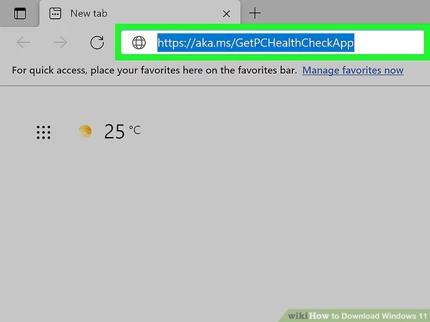
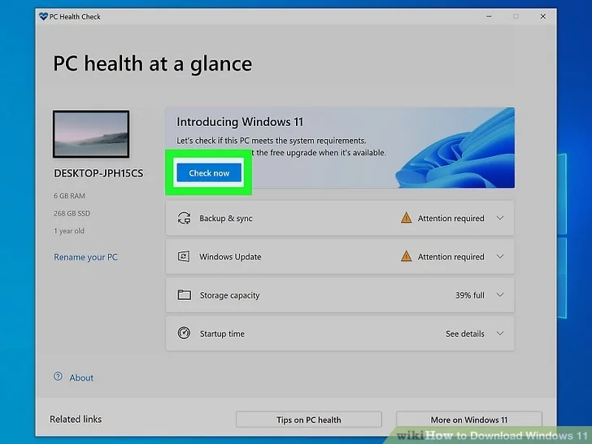
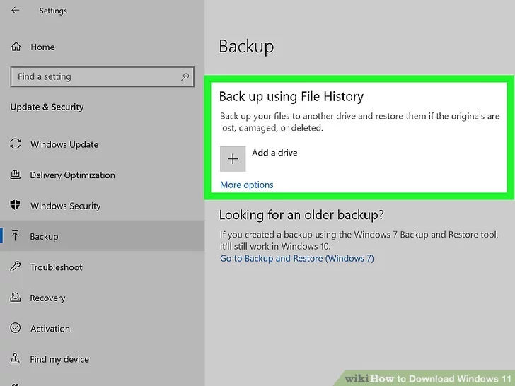
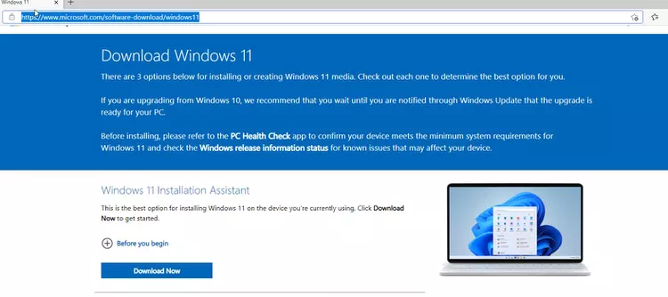
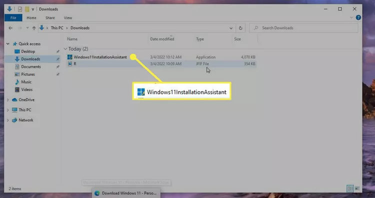
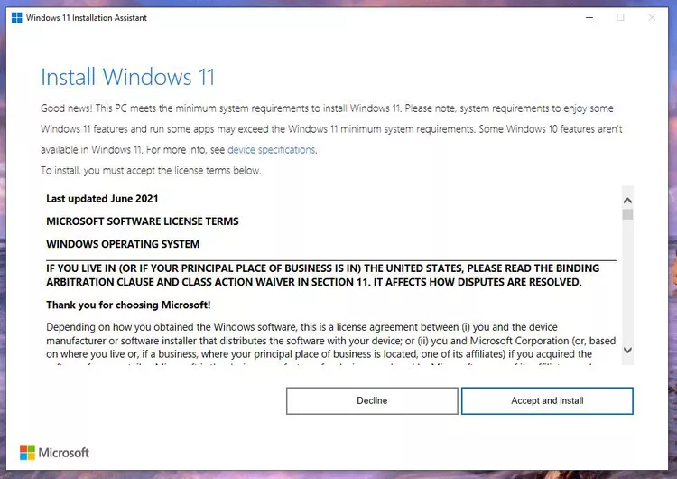
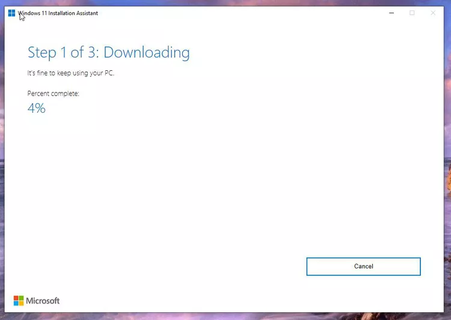
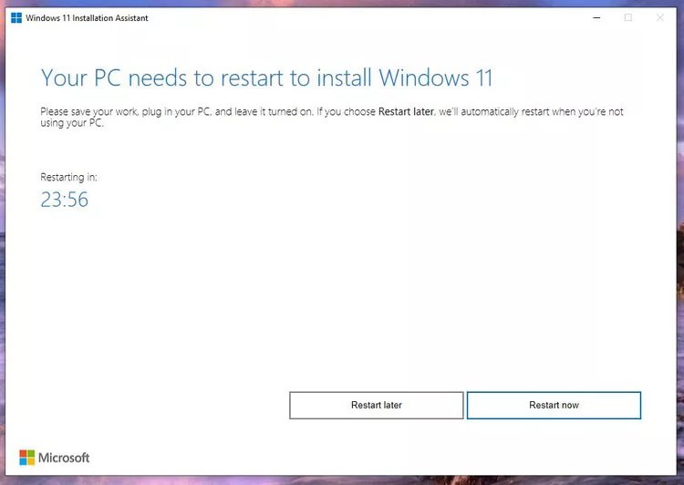

# Dev_Setup
Setup Development Environment

#Assignment: Setting Up Your Developer Environment

#Objective:
This assignment aims to familiarize you with the tools and configurations necessary to set up an efficient developer environment for software engineering projects. Completing this assignment will give you the skills required to set up a robust and productive workspace conducive to coding, debugging, version control, and collaboration.

#Tasks:

1. **Select Your Operating System (OS):**
   Choose an operating system that best suits your preferences and project requirements. Download and Install Windows 11. https://www.microsoft.com/software-download/windows11

Checking for Compatibility
Download and run the PC Health Check here https://aka.ms/GetPCHealthCheckApp

Run the app after it has completed installation, and click "check now"

Back up your PC just in case.

**Upgrading via Windows Website**
Head to the official download website https://www.microsoft.com/software-download/windows11

Select your download option.
.png>)

 Click the Download Now button under Windows 11 Installation Assistant.
 

Follow through with the process
Run the just-downloaded Windows 11 Installation Assistant executable file.

Click Accept and Install on the terms of agreement window

Windows 11 will automatically start downloading. Give the installation some time to complete.

Restart your PC

Windows 11 will automatically be installed and configured.

2. **Install a Text Editor or Integrated Development Environment (IDE):**
   Select and install a text editor or IDE suitable for your programming languages and workflow. Download and Install Visual Studio Code. https://code.visualstudio.com/Download

Head to the official download website  https://code.visualstudio.com/Download
 .png>)
 .png>)

3. **Set Up Version Control System:**
   Install Git and configure it on your local machine. Create a GitHub account for hosting your repositories. Initialize a Git repository for your project and make your first commit. https://github.com

**Download the Git Installer**
Visit the Git for Windows website and download the installer https://github.com
**Run the Installer**
Run the downloaded .exe file and follow the setup instructions.
Choose the default options unless you have specific requirements
**Verify Installation**
After installing Git, verify the installation by opening a terminal or command prompt and running:
git --version
**Configure Git**
Configure your Git environment by setting up your user information and preferred settings:

Set Your Username and Email
git config --global user.name "Mary Emmanuel"
git config --global user.email "emmamaryg124@gmail.com"

 **Confirm Configuration**
To verify your configuration, run:
git config --list

git init
git add .
git commit -m "my first commit"

https://github.com/MaryEmmanuel1/PLP_ACADEMY/blob/master/index.html

4. **Install Necessary Programming Languages and Runtimes:**
  Instal Python from http://www.python.org programming language required for your project and install their respective compilers, interpreters, or runtimes. Ensure you have the necessary tools to build and execute your code.

Visit the Python Downloads page http://wwww.python.org
.png>)

Download the latest version of Python for Windows.
.png>)

Verify the Installation:

Open Command Prompt (cmd) or PowerShell.
Run the following command to verify the installation
python --version
.png>)

5. **Install Package Managers:**
   If applicable, install package managers like pip (Python).

pip already installed with Python in the previous step.
.png>)

6. **Configure a Database (MySQL):**
   Download and install MySQL database. https://dev.mysql.com/downloads/windows/installer/5.7.html

   Download MySQL Installer:

Go to the MySQL Downloads page https://dev.mysql.com/downloads/windows/installer/5.7.html
.png>)
Download the "MySQL Installer for Windows".
.png>)
Run the Installer:
.png>)
[alt text](<Screenshot (212).png>)
.png>)
.png>)
.png>)
.png>)
.png>)
.png>)
.png>)
.png>)
.png>)
.png>)
.png>)
.png>)
.png>)
.png>)
.png>)
.png>)

7. Set Up Development Environments and Virtualization (Optional):
   Consider using virtualization tools like Docker or virtual machines to isolate project dependencies and ensure consistent environments across different machines.

8. **Explore Extensions and Plugins:**
   Explore available extensions, plugins, and add-ons for your chosen text editor or IDE to enhance functionality, such as syntax highlighting, linting, code formatting, and version control integration.

   Go to the "extension icon" on VS Code, search for syntax highlighting and install
   -1.png>)
Go to the "extension icon" on VS Code, search for linting and install
.png>)   

